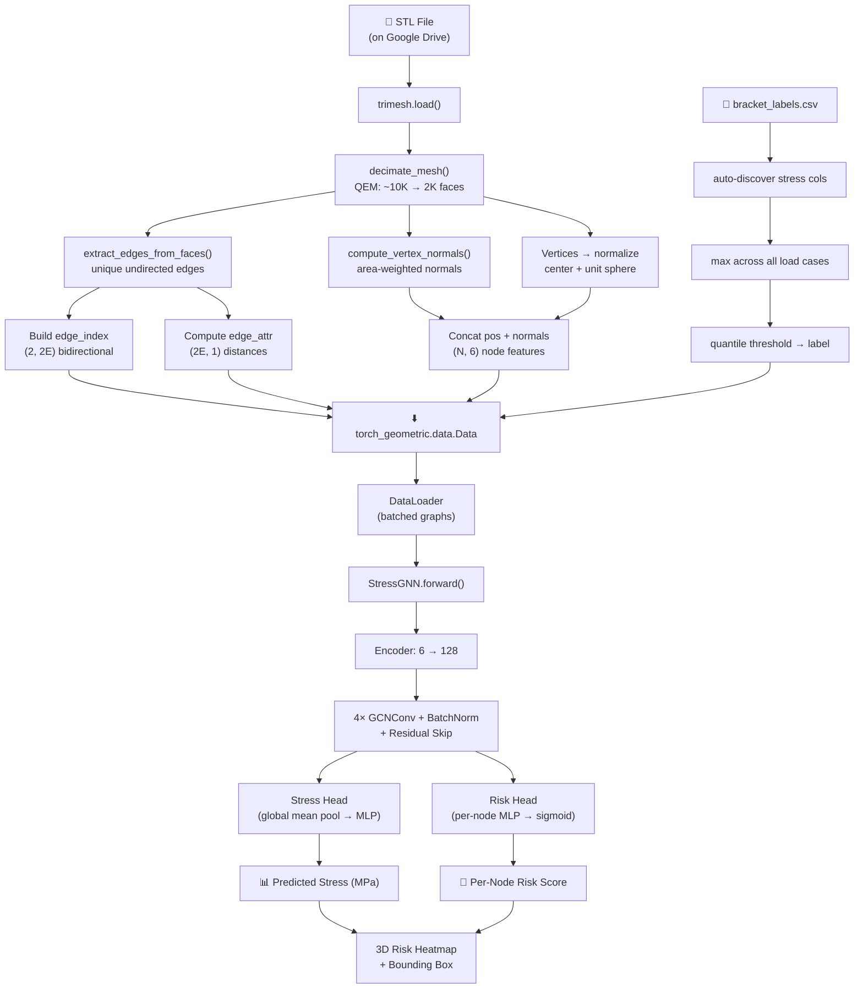

# 📖 AI 3D Stress Validator — V2 GNN Codebase Documentation

> A complete line-by-line walkthrough of every module, class, and function in the V2 Graph Neural Network pipeline. Designed to be read side-by-side with the source code.

---

## Table of Contents

1. [Project Overview](#1-project-overview)
2. [Architecture at a Glance](#2-architecture-at-a-glance)
3. [Module 1 — `mesh_to_graph.py` (Preprocessing)](#3-module-1--mesh_to_graphpy-preprocessing)
   - 3.1 [Imports & Dependencies](#31-imports--dependencies)
   - 3.2 [`decimate_mesh()` — QEM Decimation](#32-decimate_mesh--qem-decimation)
   - 3.3 [`compute_vertex_normals()` — Surface Normals](#33-compute_vertex_normals--surface-normals)
   - 3.4 [`extract_edges_from_faces()` — Edge Extraction](#34-extract_edges_from_faces--edge-extraction)
   - 3.5 [`mesh_to_graph()` — Full Conversion Pipeline](#35-mesh_to_graph--full-conversion-pipeline)
   - 3.6 [`batch_convert_stls()` — Batch Helper](#36-batch_convert_stls--batch-helper)
4. [Module 2 — `graph_dataset.py` (Data Loading)](#4-module-2--graph_datasetpy-data-loading)
   - 4.1 [Imports & Dependencies](#41-imports--dependencies)
   - 4.2 [`BracketGraphDataset` Class](#42-bracketgraphdataset-class)
   - 4.3 [`create_dataset_from_lists()` Utility](#43-create_dataset_from_lists-utility)
5. [Module 3 — `gnn_model.py` (Neural Network)](#5-module-3--gnn_modelpy-neural-network)
   - 5.1 [Imports & Dependencies](#51-imports--dependencies)
   - 5.2 [`EdgeMLP` Class — Edge Weight Module](#52-edgemlp-class--edge-weight-module)
   - 5.3 [`StressGNN` Class — The Main Model](#53-stressgnn-class--the-main-model)
   - 5.4 [`load_gnn_model()` — Weight Loading](#54-load_gnn_model--weight-loading)
   - 5.5 [`predict_stress()` — Inference Helper](#55-predict_stress--inference-helper)
6. [Module 4 — Colab Notebook Walkthrough](#6-module-4--colab-notebook-walkthrough)
   - 6.1 [Phase 0 — Setup & Dependencies](#61-phase-0--setup--dependencies)
   - 6.2 [Phase 1 — Data Loading & Preprocessing](#62-phase-1--data-loading--preprocessing)
   - 6.3 [Phase 2 — GNN Training](#63-phase-2--gnn-training)
   - 6.4 [Phase 3 — Evaluation & Inference](#64-phase-3--evaluation--inference)
7. [Module 5 — `test_smoke.py` (Tests)](#7-module-5--test_smokepy-tests)
8. [End-to-End Pipeline Flow](#8-end-to-end-pipeline-flow)
9. [Key AI/ML Concepts Explained](#9-key-aiml-concepts-explained)
10. [Performance Considerations & Debugging Tips](#10-performance-considerations--debugging-tips)
11. [References](#11-references)

---

## 1. Project Overview

### What this project does

This project takes a 3D CAD model (`.stl` file) of a mechanical bracket and predicts:

1. **Max stress value** (in megapascals, MPa) — how much mechanical strain the part will experience under load.
2. **Risk localization** — which specific region of the part is most likely to fail.

It replaces expensive Finite Element Analysis (FEA) simulations that can take hours with an AI prediction that takes **seconds**.

### Why Graph Neural Networks?

In Version 1, meshes were converted to 64³ voxel grids — like 3D pixels. This wastes memory on empty space and loses geometric detail. Version 2 treats the mesh as a **graph**:

- **Nodes** = vertices of the 3D mesh (carry position + surface normal info)
- **Edges** = connections between adjacent vertices (carry distance info)

This means the AI "thinks" in terms of the actual geometry, not a boxy approximation.

### Project file map

```
utils/
├── mesh_to_graph.py    → STL file → Graph (preprocessing)
├── graph_dataset.py    → Graphs + labels → PyG Dataset (data loading)
├── gnn_model.py        → StressGNN neural network (model definition)
└── __init__.py          → Package exports

AI_3D_Stress_Validator_V2_GNN.ipynb → Colab notebook (training + inference)
tests/test_smoke.py                 → Smoke tests
```

---

## 2. Architecture at a Glance

```
┌───────────┐    ┌──────────────┐    ┌────────────┐    ┌──────────────────────┐
│  STL File │───▶│ QEM Decimate │───▶│ Build Graph│───▶│    StressGNN Model   │
│ (raw mesh)│    │ (~80% fewer  │    │ nodes+edges│    │                      │
│           │    │  faces)      │    │ +normals   │    │  Encoder (6→128)     │
└───────────┘    └──────────────┘    │ +distances │    │  4× GCNConv + Skip   │
                                      └────────────┘    │  ┌────────┬────────┐ │
                                                        │  │Stress  │ Node   │ │
                                                        │  │Head    │ Risk   │ │
                                                        │  │(global)│ Head   │ │
                                                        │  └───┬────┴───┬────┘ │
                                                        └──────┼────────┼──────┘
                                                               │        │
                                                          Max Stress  Per-Node
                                                           (MPa)     Risk [0,1]
```

---

## 3. Module 1 — `mesh_to_graph.py` (Preprocessing)

**File:** `utils/mesh_to_graph.py` (278 lines)
**Purpose:** Convert raw STL 3D models into graph data structures that the GNN can consume.

### 3.1 Imports & Dependencies

```python
import numpy as np
import trimesh
import torch
from torch_geometric.data import Data
```

| Library | What it does | Why we need it |
|---------|-------------|----------------|
| `numpy` | N-dimensional array math | All vertex/edge computations happen as NumPy arrays before converting to tensors |
| `trimesh` | 3D mesh loading & manipulation | Loads STL files, provides vertex/face/normal data, handles decimation fallback |
| `torch` | PyTorch tensor library | Final output tensors for the neural network |
| `torch_geometric.data.Data` | PyG graph container | Standard container that holds node features, edge indices, and edge attributes in the format PyG expects |

> **Best Practice:** We import `open3d` lazily (inside `decimate_mesh`) rather than at the top. This means the module still works even if Open3D isn't installed — it falls back to trimesh's built-in decimation.

---

### 3.2 `decimate_mesh()` — QEM Decimation

```python
def decimate_mesh(mesh: trimesh.Trimesh, target_faces: int) -> trimesh.Trimesh:
```

**Purpose:** Reduce the number of triangles in a mesh while preserving important geometric features.

#### Detailed Explanation

**Line 45 — Early exit check:**
```python
if len(mesh.faces) <= target_faces:
    return mesh
```
If the mesh already has fewer faces than our target, we skip decimation entirely. This avoids unnecessary computation and prevents edge cases where decimation might fail on very simple meshes.

**Lines 49–66 — Open3D path (preferred):**
```python
import open3d as o3d

o3d_mesh = o3d.geometry.TriangleMesh()
o3d_mesh.vertices = o3d.utility.Vector3dVector(mesh.vertices)
o3d_mesh.triangles = o3d.utility.Vector3iVector(mesh.faces)
o3d_mesh.compute_vertex_normals()
```

This block:
1. Imports Open3D inside the function (lazy import — if Open3D isn't installed, we catch the `ImportError`)
2. Creates an empty Open3D `TriangleMesh` object
3. Copies our trimesh vertices into it using `Vector3dVector` (a wrapper that converts NumPy arrays to Open3D's internal format)
4. Copies our faces using `Vector3iVector` (integer version for triangle indices)
5. Pre-computes normals (required for proper QEM error calculation)

```python
decimated = o3d_mesh.simplify_quadric_decimation(
    target_number_of_triangles=target_faces
)
```

**What is Quadric Error Metrics (QEM)?**

QEM is an algorithm invented by Michael Garland and Paul Heckbert (1997). For every edge in the mesh, it computes a "cost" of collapsing that edge into a single point. The cost is based on how much the local surface shape would change — a matrix called the **quadric error matrix**. Edges in flat regions have low cost (safe to remove); edges near holes, corners, and fillets have high cost (preserved). The algorithm greedily collapses the cheapest edges until it hits the target face count.

**Why Open3D's implementation is preferred:** It handles manifold edge cases better and is generally faster than trimesh's implementation for large meshes.

```python
result = trimesh.Trimesh(
    vertices=np.asarray(decimated.vertices),
    faces=np.asarray(decimated.triangles),
    process=True,
)
```

After decimation, we convert back to a trimesh object. `process=True` tells trimesh to merge duplicate vertices and remove degenerate faces.

**Lines 68–71 — Fallback path:**
```python
except ImportError:
    result = mesh.simplify_quadric_decimation(target_faces)
    return result
```

If Open3D isn't available, we use trimesh's built-in QEM (which works but is slightly less robust).

#### Common Errors

| Error | Cause | Fix |
|-------|-------|-----|
| `ImportError: No module named 'open3d'` | Open3D not installed | `pip install open3d` — or the fallback kicks in automatically |
| Output has 0 faces | Mesh was degenerate or target was 0 | Check input mesh validity with `mesh.is_watertight` |
| Output has more faces than target | QEM couldn't simplify further | Normal for low targets on simple meshes; the mesh is already at minimum complexity |

---

### 3.3 `compute_vertex_normals()` — Surface Normals

```python
def compute_vertex_normals(mesh: trimesh.Trimesh) -> np.ndarray:
```

**Purpose:** Calculate the direction each vertex "faces" — this gives the GNN directional context about the surface.

#### Detailed Explanation

```python
vertex_normals = mesh.vertex_normals.copy()
```

`mesh.vertex_normals` is a property of trimesh that computes per-vertex normals using **area-weighted averaging** of adjacent face normals. Here's what that means:

Each face (triangle) has a single normal vector perpendicular to it. A vertex is shared by multiple faces. The vertex normal is the average of all those face normals, weighted by each face's area — larger faces contribute more. The `.copy()` ensures we don't accidentally modify trimesh's internal cache.

```python
norms = np.linalg.norm(vertex_normals, axis=1, keepdims=True)
norms = np.clip(norms, 1e-8, None)
vertex_normals = vertex_normals / norms
```

**Line-by-line:**
1. `np.linalg.norm(..., axis=1, keepdims=True)` — Compute the length (magnitude) of each normal vector. `axis=1` means we compute along the XYZ dimension. `keepdims=True` keeps the shape as `(N, 1)` instead of `(N,)` so broadcasting works correctly in the division.
2. `np.clip(norms, 1e-8, None)` — Clamp to a tiny minimum value. If a vertex has a degenerate normal (e.g., from a zero-area face), its norm could be 0, causing division by zero. `1e-8` is small enough to not affect valid normals but prevents NaN.
3. Divide to make all normals unit length (magnitude = 1). This normalization ensures the GNN treats normal direction independent of its magnitude.

```python
return vertex_normals.astype(np.float32)
```

Cast to `float32` to match PyTorch's default precision. Using `float64` would waste memory without improving results.

#### Why Surface Normals Matter for Stress Prediction

Consider two vertices with the same (x, y, z) coordinates. One is on the flat outside of a bracket plate; the other is on the curved inside wall of a bolt hole. Without normals, the AI can't tell these apart. The normal direction encodes whether the surface curves inward (concave — stress concentrator!) or outward (convex — usually fine).

---

### 3.4 `extract_edges_from_faces()` — Edge Extraction

```python
def extract_edges_from_faces(faces: np.ndarray) -> np.ndarray:
```

**Purpose:** Build a list of unique edges from the triangle mesh. Each triangle contributes 3 edges.

#### Detailed Explanation

```python
edges = np.vstack([
    faces[:, [0, 1]],
    faces[:, [1, 2]],
    faces[:, [0, 2]],
])
```

A triangle face has 3 vertex indices `(a, b, c)`. Its edges are the 3 pairs: `(a,b)`, `(b,c)`, `(a,c)`. `faces[:, [0, 1]]` selects columns 0 and 1 from every row — giving us the first edge of every triangle. `np.vstack` stacks all three sets into a single array of shape `(3F, 2)`.

```python
edges = np.sort(edges, axis=1)
```

For deduplication, we need each edge represented consistently. `(3, 7)` and `(7, 3)` are the same edge, so we sort each row so the smaller index comes first. After sorting, both become `(3, 7)`.

```python
edges = np.unique(edges, axis=0)
```

`np.unique` with `axis=0` removes duplicate rows. Since shared edges appear in multiple triangles (typically 2 for a manifold mesh), this reduces the count from `3F` down to `E` unique edges.

#### Performance Note

For a mesh with 2,000 faces, this produces roughly 3,000 unique edges. The `np.unique` call does a sort internally (`O(E log E)`), which is efficient enough for meshes of this size.

---

### 3.5 `mesh_to_graph()` — Full Conversion Pipeline

```python
def mesh_to_graph(
    stl_path: str,
    target_faces: int = 2000,
    normalize_pos: bool = True,
) -> Data:
```

**Purpose:** The main entry point. Takes an STL file path and returns a fully-formed PyTorch Geometric `Data` object.

#### Detailed Explanation — Step by Step

**Step 1 — Load mesh:**
```python
mesh = trimesh.load(stl_path, force="mesh")
```

`force="mesh"` tells trimesh to load the file as a single `Trimesh` object even if it contains multiple bodies (a `Scene`). Without this, trimesh might return a `Scene` object and our code would break.

**Step 2 — Decimate:**
```python
mesh = decimate_mesh(mesh, target_faces)
```

Reduces complexity. A typical DeepJEB bracket has ~10,000+ faces; after decimation to 2,000, we have ~1,000 vertices — a manageable graph for a Colab T4 GPU.

**Step 3 — Extract vertices and edges:**
```python
vertices = mesh.vertices.astype(np.float32)  # (N, 3)
edges = extract_edges_from_faces(mesh.faces)   # (E, 2) undirected
```

`mesh.vertices` returns an `(N, 3)` array of XYZ coordinates. `mesh.faces` returns an `(F, 3)` array of triangle vertex indices.

**Step 4 — Compute normals:**
```python
normals = compute_vertex_normals(mesh)  # (N, 3)
```

One normal vector per vertex — see Section 3.3.

**Step 5 — Normalize positions:**
```python
raw_pos = vertices.copy()
if normalize_pos:
    centroid = vertices.mean(axis=0)
    vertices = vertices - centroid
    max_dist = np.max(np.linalg.norm(vertices, axis=1))
    if max_dist > 1e-8:
        vertices = vertices / max_dist
```

**Why normalize?** Different bracket designs have different sizes and positions in 3D space. A bracket at coordinates (500, 200, 300) and another at (0.01, 0.005, 0.003) would have wildly different feature scales. Neural networks learn much better when inputs are centered around 0 and scaled to a consistent range.

- `vertices.mean(axis=0)` — Compute the centroid (mean X, mean Y, mean Z)
- Subtract centroid — now the model is centered at origin
- `np.linalg.norm(vertices, axis=1)` — Distance of each vertex from origin
- Divide by max distance — now all vertices fit inside a unit sphere (radius 1)

**We save `raw_pos`** before normalizing because we need the original coordinates later for visualization.

**Step 6 — Build node features:**
```python
node_features = np.hstack([vertices, normals])  # (N, 6)
```

`np.hstack` concatenates the normalized position `[x, y, z]` and normal `[nx, ny, nz]` into a 6-dimensional feature vector per node. This is what the GNN encoder will consume.

**Step 7 — Build bidirectional edge_index:**
```python
edge_index = np.vstack([
    np.hstack([edges[:, 0], edges[:, 1]]),
    np.hstack([edges[:, 1], edges[:, 0]]),
])  # (2, 2E)
```

PyTorch Geometric uses **COO (Coordinate) format** for edge indices. The shape must be `(2, num_edges)` where:
- Row 0 = source node indices
- Row 1 = destination node indices

GNNs require **bidirectional edges** — if node A connects to node B, we need both `(A→B)` and `(B→A)`. So we duplicate the edges in both directions, doubling the count from E to 2E.

**Step 8 — Compute edge lengths:**
```python
src_pos = raw_pos[edge_index[0]]
dst_pos = raw_pos[edge_index[1]]
edge_lengths = np.linalg.norm(src_pos - dst_pos, axis=1, keepdims=True)
edge_lengths = edge_lengths.astype(np.float32)

max_len = edge_lengths.max()
if max_len > 1e-8:
    edge_lengths = edge_lengths / max_len
```

For each edge, we look up the **raw (un-normalized) positions** of both endpoints, compute the Euclidean distance between them, then normalize the lengths to `[0, 1]` range. We use raw positions (not normalized ones) because the actual physical distance matters for stress analysis — a 0.5mm wall and a 50mm wall should be distinguishable.

**Step 9 — Convert to tensors and package:**
```python
x = torch.tensor(node_features, dtype=torch.float32)
edge_index_t = torch.tensor(edge_index, dtype=torch.long)
edge_attr = torch.tensor(edge_lengths, dtype=torch.float32)
pos = torch.tensor(raw_pos, dtype=torch.float32)

data = Data(
    x=x,
    edge_index=edge_index_t,
    edge_attr=edge_attr,
    pos=pos,
    num_nodes=x.shape[0],
)
```

| Attribute | Shape | Dtype | Description |
|-----------|-------|-------|-------------|
| `x` | `(N, 6)` | float32 | Node features: normalized position + normal |
| `edge_index` | `(2, 2E)` | int64 (long) | Source/dest node indices (bidirectional) |
| `edge_attr` | `(2E, 1)` | float32 | Normalized edge lengths |
| `pos` | `(N, 3)` | float32 | Raw world-space positions (for visualization) |
| `num_nodes` | scalar | int | Explicit node count |

`edge_index` must be `torch.long` (int64) because PyG uses these as array indices.

---

### 3.6 `batch_convert_stls()` — Batch Helper

```python
def batch_convert_stls(stl_paths, target_faces=2000, normalize_pos=True, verbose=True):
```

A convenience wrapper that iterates over a list of STL file paths, calls `mesh_to_graph()` on each, catches errors per-file (so one bad mesh doesn't crash the whole batch), and prints progress every 25 files.

---

## 4. Module 2 — `graph_dataset.py` (Data Loading)

**File:** `utils/graph_dataset.py` (191 lines)
**Purpose:** A PyTorch Geometric `InMemoryDataset` that ties together mesh conversion and stress labels from the CSV.

### 4.1 Imports & Dependencies

```python
import os, glob
import numpy as np
import pandas as pd
import torch
from torch_geometric.data import Data, InMemoryDataset
from .mesh_to_graph import mesh_to_graph
```

| Library | What it does |
|---------|-------------|
| `pandas` | Reads `bracket_labels.csv` and provides DataFrame operations for label processing |
| `InMemoryDataset` | PyG base class that loads all data into RAM at once (efficient for our 250-sample dataset) |
| `.mesh_to_graph` | Relative import from our own module — the conversion pipeline from Section 3 |

### 4.2 `BracketGraphDataset` Class

```python
class BracketGraphDataset(InMemoryDataset):
```

**What is `InMemoryDataset`?**

PyTorch Geometric's `InMemoryDataset` is a base class for datasets small enough to fit in RAM. It:
1. Checks if processed files already exist on disk (in a `processed/` subfolder)
2. If not, calls `self.process()` to create them
3. Loads the processed `.pt` file into memory
4. Provides standard `__len__` and `__getitem__` methods for PyTorch's DataLoader

#### `__init__` Method

```python
def __init__(self, root, stl_dir, csv_path, target_faces=2000,
             stress_fail_quantile=0.80, num_samples=None, ...):
    self.stl_dir = stl_dir
    self.csv_path = csv_path
    self.target_faces = target_faces
    self.stress_fail_quantile = stress_fail_quantile
    self.num_samples = num_samples

    super().__init__(root, transform, pre_transform, pre_filter)
    self.load(self.processed_paths[0])
```

**Critical order:** We store our custom attributes **before** calling `super().__init__()`. This is because the parent's `__init__` may call `self.process()`, which needs `self.stl_dir`, `self.csv_path`, etc. to already exist.

`self.load(self.processed_paths[0])` loads the saved `.pt` file into `self.data` and `self.slices`, making the dataset iterable.

#### `processed_file_names` Property

```python
@property
def processed_file_names(self):
    return [f"bracket_graphs_f{self.target_faces}.pt"]
```

The filename includes `target_faces` so that if you change the decimation level, it reprocesses instead of using stale data.

#### `process()` Method — The Heart of the Dataset

**Step 1 — Discover STL files:**
```python
stl_files = sorted(glob.glob(os.path.join(self.stl_dir, "**", "*.stl"), recursive=True))
```

`glob.glob` with `recursive=True` and `**` pattern finds all `.stl` files in any subfolder of `stl_dir`.

**Step 2 — Load and process stress labels dynamically:**
```python
df = pd.read_csv(self.csv_path)
stress_cols = [c for c in df.columns if "stress" in c.lower()]
df["max_stress_all"] = df[stress_cols].max(axis=1)
```

Instead of hardcoding 4 specific column names, we **auto-discover** every column containing "stress" in its name. `df[stress_cols].max(axis=1)` takes the maximum across all stress columns for each row — this gives us the worst-case stress value regardless of load direction.

**Step 3 — Labeling strategy:**
```python
threshold = df["max_stress_all"].quantile(self.stress_fail_quantile)
df["label"] = (df["max_stress_all"] >= threshold).astype(float)
```

`quantile(0.80)` returns the stress value at the 80th percentile. Parts above this are labeled as FAIL (1.0), below as PASS (0.0). This creates a dataset with roughly 20% fail and 80% pass samples.

**Step 4 — Build lookup dictionaries:**
```python
stress_lookup = {}
label_lookup = {}
for _, row in df.iterrows():
    name = str(row["item_name"])
    stress_lookup[name] = float(row["max_stress_all"])
    label_lookup[name] = float(row["label"])
```

We build dictionaries keyed by `item_name` so we can quickly match each STL file to its stress value and label by filename.

**Step 5 — Convert and label each mesh:**
```python
graph = mesh_to_graph(stl_path, target_faces=self.target_faces)

graph.y = torch.tensor([label], dtype=torch.float32)
graph.stress_value = torch.tensor([stress_val], dtype=torch.float32)
graph.item_name = basename
```

For each STL file, we call `mesh_to_graph()` (the pipeline from Module 1), then attach:
- `y` — the binary label (used in classification loss)
- `stress_value` — the continuous MPa value (used in regression loss)
- `item_name` — string identifier for debugging

**Step 6 — Apply hooks and save:**
```python
if self.pre_filter is not None:
    data_list = [d for d in data_list if self.pre_filter(d)]
if self.pre_transform is not None:
    data_list = [self.pre_transform(d) for d in data_list]
self.save(data_list, self.processed_paths[0])
```

`pre_filter` and `pre_transform` are standard PyG hooks — if provided, they can filter out unwanted graphs or apply transforms (e.g., adding self-loops). `save()` serializes to a `.pt` file.

### 4.3 `create_dataset_from_lists()` Utility

```python
def create_dataset_from_lists(graph_data_list, labels, stress_values=None, item_names=None):
```

A convenience function for when you've already converted graphs in a Colab cell and just need to attach labels. The notebook does its own conversion inline (for progress feedback), so this function is mainly useful for custom scripts.

---

## 5. Module 3 — `gnn_model.py` (Neural Network)

**File:** `utils/gnn_model.py` (268 lines)
**Purpose:** Define the `StressGNN` neural network model and inference helpers.

### 5.1 Imports & Dependencies

```python
import torch
import torch.nn as nn
import torch.nn.functional as F
from torch_geometric.nn import GCNConv, global_mean_pool
```

| Import | What it provides |
|--------|-----------------|
| `torch.nn` | Neural network building blocks (`Linear`, `BatchNorm1d`, `Dropout`, `Sequential`, etc.) |
| `torch.nn.functional` (`F`) | Stateless functions like `F.relu()` — used when we don't need learnable parameters |
| `GCNConv` | **Graph Convolutional Network** layer from PyG — the core message-passing operation |
| `global_mean_pool` | Aggregates all node features in a graph into a single vector by averaging |

### 5.2 `EdgeMLP` Class — Edge Weight Module

```python
class EdgeMLP(nn.Module):
    def __init__(self, edge_dim=1, hidden_dim=16):
        super().__init__()
        self.mlp = nn.Sequential(
            nn.Linear(edge_dim, hidden_dim),     # 1 → 16
            nn.ReLU(inplace=True),
            nn.Linear(hidden_dim, 1),            # 16 → 1
            nn.Sigmoid(),                         # output in [0, 1]
        )
```

**Purpose:** Transform edge distances into scalar weights that tell the GNN how much to "trust" each connection.

**Why `Sigmoid()`?** The output must be a weight in [0, 1]. A weight of 0 means "ignore this edge," a weight of 1 means "fully trust this message." Short edges (tight structural connections) should pass more information than long edges (loose connections).

**Why a learnable MLP instead of a fixed formula?** Because the optimal distance-to-importance mapping depends on the data distribution. The network learns, for example, that edges of length 0.3 (normalized) are more structurally important than edges of length 0.8. A fixed formula like `1/distance` might not capture these nuances.

```python
def forward(self, edge_attr):
    return self.mlp(edge_attr).squeeze(-1)  # (E, 1) → (E,)
```

`.squeeze(-1)` removes the trailing dimension because `GCNConv` expects `edge_weight` as a 1D tensor of shape `(E,)`, not `(E, 1)`.

---

### 5.3 `StressGNN` Class — The Main Model

```python
class StressGNN(nn.Module):
```

This is the core neural network. It has three stages: **Encoder**, **Message Passing**, and **Dual Output Heads**.

#### Stage 1 — Encoder

```python
self.encoder = nn.Sequential(
    nn.Linear(in_channels, 64),       # 6 → 64
    nn.ReLU(inplace=True),
    nn.Linear(64, hidden_channels),   # 64 → 128
    nn.ReLU(inplace=True),
)
```

**What it does:** Projects the 6-dimensional input features `[x, y, z, nx, ny, nz]` into a 128-dimensional latent space. The GCN layers work in this 128-dim space.

**Why two layers?** A single linear layer (`6 → 128`) would only learn a linear mapping. Two layers with ReLU in between can learn non-linear relationships — e.g., that the combination of "vertex is low on the Z-axis" AND "normal points inward" together indicate a hole interior.

**`inplace=True`** on ReLU saves memory by modifying the tensor in-place rather than creating a copy. Safe here because we don't need the pre-activation values.

#### Stage 2 — Message Passing (GCN Layers)

```python
self.convs = nn.ModuleList()
self.bns = nn.ModuleList()
for _ in range(num_gnn_layers):         # 4 times
    self.convs.append(GCNConv(hidden_channels, hidden_channels))
    self.bns.append(nn.BatchNorm1d(hidden_channels))
```

**`nn.ModuleList`** — A PyTorch container that registers sub-modules properly so their parameters appear in `model.parameters()`. A regular Python `list` would **not** register them, and they'd be invisible to the optimizer.

**`GCNConv(128, 128)`** — A Graph Convolutional Network layer from the paper *"Semi-Supervised Classification with Graph Convolutional Networks"* by Kipf & Welling (2017). Each layer:
1. For each node, gathers the features of its neighbors
2. Multiplies each neighbor's features by `1/sqrt(deg(src) * deg(dst))` (normalization by node degree)
3. Sums the gathered features
4. Applies a learnable linear transformation

In plain English: each node "asks" its neighbors "what do you know?" and combines their answers with its own knowledge.

**`BatchNorm1d(128)`** — Normalizes activations across the batch dimension. Prevents internal covariate shift and helps training converge faster.

**Why 4 layers?** Each GCN layer lets information travel one "hop" in the graph. With 4 layers, a node can receive information from nodes up to 4 edges away. For a bracket, this is enough to "feel" how the geometry curves and connects across the part.

#### In the Forward Pass — Residual Connections

```python
for i in range(self.num_gnn_layers):
    identity = x
    x = self.convs[i](x, edge_index, edge_weight=edge_weight)
    x = self.bns[i](x)
    x = F.relu(x)
    x = x + identity  # skip connection
```

**Residual (skip) connections** — `x = x + identity` adds the input of each layer back to its output. This idea comes from *ResNet* (He et al., 2016). Without skip connections, deep GNNs suffer from **over-smoothing** — after many layers, all node features converge to the same value, losing local information. Skip connections let the network preserve the original features alongside the aggregated ones.

**`edge_weight`** — The scalar weights from the `EdgeMLP`. `GCNConv` multiplies each message by this weight before aggregation. Closer nodes (shorter edges → higher weights) influence each other more.

#### Stage 3a — Regression Head (Global Stress Prediction)

```python
# 5. Global pooling for stress regression
if batch is not None:
    pooled = global_mean_pool(x, batch)  # (B, hidden)
else:
    pooled = x.mean(dim=0, keepdim=True)  # (1, hidden)

stress = self.stress_head(pooled)  # (B, 1)
```

**`global_mean_pool(x, batch)`** — When multiple graphs are batched together (standard in training), PyG concatenates all their nodes into one big tensor. The `batch` vector tells us which node belongs to which graph — e.g., `[0,0,0,1,1,1,1,2,2]` means 3 nodes in graph 0, 4 in graph 1, 2 in graph 2. `global_mean_pool` averages each graph's nodes separately, producing one vector per graph.

**The stress head:**
```python
self.stress_head = nn.Sequential(
    nn.Linear(hidden_channels, 64),   # 128 → 64
    nn.ReLU(inplace=True),
    nn.Dropout(dropout),               # 30% dropout
    nn.Linear(64, 32),                 # 64 → 32
    nn.ReLU(inplace=True),
    nn.Linear(32, 1),                  # 32 → 1
    nn.ReLU(inplace=True),             # stress ≥ 0
)
```

Final `ReLU` ensures the output is non-negative — stress values in MPa are always positive.

**`Dropout(0.3)`** — During training, randomly zeroes 30% of neurons. This regularizes the model, preventing overfitting. During inference (`model.eval()`), dropout is automatically disabled.

#### Stage 3b — Localization Head (Per-Node Risk)

```python
# 4. Per-node risk scores (before pooling)
node_risk = torch.sigmoid(self.risk_head(x))  # (N, 1)
```

This head runs **before** global pooling — it operates on individual node features, not the pooled graph representation. Each node gets a risk score between 0 and 1 indicating how likely it is to be in the failure zone.

`torch.sigmoid` maps the raw logit from the MLP to `[0, 1]` range.

---

### 5.4 `load_gnn_model()` — Weight Loading

```python
def load_gnn_model(weights_path, device="cpu", **model_kwargs):
    model = StressGNN(**model_kwargs)
    state = torch.load(weights_path, map_location=device, weights_only=True)
    model.load_state_dict(state)
    model.to(device)
    model.eval()
    return model
```

- `**model_kwargs` lets you pass custom hyperparameters (e.g., `hidden_channels=64`)
- `map_location=device` handles the case where the model was saved on GPU but you're loading on CPU (or vice versa)
- `weights_only=True` is a security measure — prevents pickle attacks from malicious `.pth` files
- `model.eval()` switches to inference mode (disables dropout, uses running stats for BatchNorm)

### 5.5 `predict_stress()` — Inference Helper

```python
def predict_stress(model, data, device="cpu"):
```

Runs a single graph through the model and returns a clean dictionary:

```python
model.eval()
data = data.to(device)

with torch.no_grad():
    out = model(data)
```

`torch.no_grad()` disables gradient computation — this saves memory and speeds up inference since we don't need gradients for backpropagation.

```python
stress_val = out["stress"].item()
```

`.item()` extracts a scalar from a single-element tensor.

```python
node_risk = out["node_risk"].squeeze(-1).cpu().numpy()
max_risk_idx = int(np.argmax(node_risk))
max_risk_score = float(node_risk[max_risk_idx])
```

Find the node with the highest risk score — this is the center of the danger zone.

```python
if hasattr(data, "pos") and data.pos is not None:
    max_risk_pos = data.pos[max_risk_idx].cpu().numpy()
else:
    max_risk_pos = data.x[max_risk_idx, :3].cpu().numpy()
```

Get the world-space XYZ position of that node. Prefers `data.pos` (raw coordinates) over `data.x[:, :3]` (which are normalized).

---

## 6. Module 4 — Colab Notebook Walkthrough

**File:** `AI_3D_Stress_Validator_V2_GNN.ipynb`

### 6.1 Phase 0 — Setup & Dependencies

#### Cell 0.1 — Install packages

```python
!pip install -q torch-geometric
!pip install -q trimesh open3d scipy pandas matplotlib scikit-learn
```

`-q` means quiet mode (less output). `torch-geometric` (PyG) is the graph neural network framework that runs on top of PyTorch.

#### Cell 0.2 — Mount Google Drive

```python
from google.colab import drive
drive.mount('/content/drive')

DATA_ROOT       = '/content/drive/MyDrive/AI_Stress_Validator'
DRIVE_MODEL_DIR = '/content/drive/MyDrive/AI_Stress_Validator/GNN_Model'
GRAPH_CACHE_DIR = '/content/drive/MyDrive/AI_Stress_Validator/Graph_Cache'
```

**Why Drive?** Colab VMs are ephemeral — when the session dies, all data is lost. By reading from and saving to Drive, we persist across sessions. The graph cache means you only convert STL→graph once.

#### Cell 0.3 — Configuration Constants

| Constant | Value | Purpose |
|----------|-------|---------|
| `TARGET_FACES` | 2000 | QEM decimation target — ~80% reduction |
| `IN_CHANNELS` | 6 | `[x, y, z, nx, ny, nz]` |
| `HIDDEN_CHANNELS` | 128 | GCN latent dimension |
| `NUM_GNN_LAYERS` | 4 | Message-passing depth |
| `BATCH_SIZE` | 16 | Graphs per training step |
| `LEARNING_RATE` | 1e-3 | Adam optimizer starting LR |
| `NUM_EPOCHS` | 80 | Maximum training epochs |
| `LAMBDA_STRESS` | 1.0 | Weight for stress MSE loss |
| `LAMBDA_RISK` | 0.5 | Weight for node-risk BCE loss |

### 6.2 Phase 1 — Data Loading & Preprocessing

#### Cell 1.2 — Dynamic Stress Column Discovery

```python
STRESS_COLS = [c for c in df.columns if 'stress' in c.lower()]
```

This **list comprehension** iterates over every column name in the DataFrame and keeps those containing the substring "stress" (case-insensitive). This means if the CSV has 8 stress columns instead of 4, all 8 are used — more data, better predictions.

```python
df['max_stress_all'] = df[STRESS_COLS].max(axis=1)
```

`df[STRESS_COLS]` selects only the stress columns (a sub-DataFrame). `.max(axis=1)` takes the maximum across columns for each row — the worst-case stress regardless of load direction.

#### Cell 1.3 — Graph Conversion with Caching

```python
GRAPH_CACHE_FILE = os.path.join(GRAPH_CACHE_DIR, f'graphs_f{TARGET_FACES}_n{NUM_SAMPLES}.pkl')

if os.path.exists(GRAPH_CACHE_FILE):
    with open(GRAPH_CACHE_FILE, 'rb') as f:
        graph_list = pickle.load(f)
```

The cache filename includes `TARGET_FACES` and `NUM_SAMPLES` so different configurations use different cache files. `pickle` serializes Python objects (including PyG `Data` objects) to bytes.

### 6.3 Phase 2 — GNN Training

#### Cell 2.1 — Stratified Train/Val Split

```python
from sklearn.model_selection import train_test_split

labels = [int(d.y.item()) for d in graph_list]
train_data, val_data = train_test_split(
    graph_list, test_size=VAL_SPLIT, stratify=labels, random_state=42
)
```

`stratify=labels` ensures the train and validation sets have the same FAIL/PASS ratio as the full dataset. Without this, the validation set might randomly get 0 FAIL samples, making metrics meaningless.

`random_state=42` makes the split reproducible. The "42" is arbitrary (it's a reference to *The Hitchhiker's Guide to the Galaxy*).

#### Cell 2.2 — Loss Functions

```python
stress_loss_fn = nn.MSELoss()    # Mean Squared Error for regression
risk_loss_fn   = nn.BCELoss()    # Binary Cross-Entropy for classification
```

**MSE (Mean Squared Error):** `(predicted - true)²` averaged over the batch. Penalizes large errors quadratically.

**BCE (Binary Cross-Entropy):** `-[y·log(p) + (1-y)·log(1-p)]` where `y` is 0 or 1 and `p` is the predicted probability. Standard loss for binary classification.

The total loss is: `loss = 1.0 × MSE(stress) + 0.5 × BCE(node_risk)`

The 0.5 weight on risk loss means we prioritize accurate stress magnitude over node localization.

#### Cell 2.3 — Training Loop Deep Dive

**Node-risk label broadcasting:**
```python
node_labels = batch.y[batch.batch].view(-1, 1)
```

This is a key line. `batch.y` has shape `(B,)` — one label per graph. `batch.batch` has shape `(N_total,)` — for each node, it stores which graph it belongs to (0, 1, 2, ...). `batch.y[batch.batch]` "broadcasts" the graph-level label to every node in that graph. So if graph 0 is FAIL (1.0), all 500 nodes of graph 0 get label 1.0.

**Why this works even without per-node ground truth:** We don't have FEA data for individual nodes — only per-part labels. By assigning the part's label to all its nodes, we teach the model that "in failing parts, nodes are generally risky." The model then learns to differentiate which specific nodes within a failing part are *most* risky through gradient flow.

**Early stopping:**
```python
if patience_counter >= EARLY_STOP_PATIENCE:
    print(f'Early stopping at epoch {epoch}')
    break
```

If validation loss doesn't improve for 20 consecutive epochs, training stops. This prevents overfitting — the model starts memorizing training data instead of learning generalizable patterns.

**Learning rate scheduling:**
```python
scheduler = torch.optim.lr_scheduler.ReduceLROnPlateau(
    optimizer, mode='min', factor=0.5, patience=10
)
```

If validation loss doesn't improve for 10 epochs, the learning rate is halved. This helps the optimizer converge to a better minimum — at first, large steps find the right region; later, small steps fine-tune.

### 6.4 Phase 3 — Evaluation & Inference

#### Cell 3.1 — Evaluation Metrics

```python
from sklearn.metrics import r2_score, mean_absolute_error, accuracy_score
```

| Metric | What it measures | Perfect score |
|--------|-----------------|---------------|
| **MAE** | Average absolute difference between predicted and true stress | 0 MPa |
| **R²** | How much variance in true stress is explained by predictions | 1.0 |
| **Accuracy** | Percentage of correctly classified pass/fail parts | 100% |

#### Cell 3.3 — 3D Risk Heatmap Visualization

The visualization creates two 3D scatter plots side by side:

1. **Full model heatmap:** Every node colored by risk score (yellow = safe, red = risky)
2. **Danger zone close-up:** Zoomed in on the highest-risk area with a translucent red bounding box

The bounding box is drawn using `Poly3DCollection` from matplotlib — 8 corner points defining 6 rectangular faces with `alpha=0.15` for translucency.

---

## 7. Module 5 — `test_smoke.py` (Tests)

**File:** `tests/test_smoke.py`
**Purpose:** Quick sanity checks that the code works with synthetic data — no real STL files or GPU required.

| Test | What it verifies |
|------|-----------------|
| `test_output_data_type` | `mesh_to_graph` returns a PyG `Data` object |
| `test_node_features_shape` | Node features are `(N, 6)` — 6 dimensions |
| `test_edge_index_shape` | Edge index is `(2, E)` and bidirectional (even count) |
| `test_edge_attr_shape` | Edge attributes are `(E, 1)` matching edge count |
| `test_edge_lengths_positive` | All distances ≥ 0 |
| `test_decimation_reduces_faces` | Decimated mesh has fewer faces than original |
| `test_forward_pass_output_keys` | Model returns `"stress"` and `"node_risk"` |
| `test_forward_pass_shapes` | Stress is `(1, 1)`, node_risk is `(N, 1)` |
| `test_stress_non_negative` | Predicted stress ≥ 0 (ReLU output) |
| `test_risk_scores_bounded` | Risk scores in [0, 1] (sigmoid output) |

Run with:
```bash
python -m pytest tests/test_smoke.py -v
```

---

## 8. End-to-End Pipeline Flow



---

## 9. Key AI/ML Concepts Explained

### Message Passing in GNNs

Message passing is the core operation that distinguishes GNNs from regular neural networks. In each layer:

1. **Message:** Each node creates a "message" to send to its neighbors (its current feature vector)
2. **Aggregate:** Each node collects all incoming messages from neighbors and aggregates them (sum, mean, or max)
3. **Update:** Each node combines its own features with the aggregated messages to produce a new feature vector

After K layers, each node's features encode information from neighbors up to K hops away. This is how the network "simulates" stress propagation — stress doesn't jump across the part; it travels through connected material, one element at a time.

### Over-Smoothing Problem

With too many GCN layers, all node features converge to the same value — the graph's "average." This is called **over-smoothing**. It happens because repeated averaging washes out local differences.

**Our mitigation:** Residual (skip) connections (`x = x + identity`). Even after 4 layers of aggregation, each node retains its original encoded features.

### Multi-Task Learning (Dual Heads)

The model jointly learns two tasks:
1. **Regression:** Predict continuous stress value
2. **Localization:** Classify each node as risky or safe

These tasks share the same encoder and GCN layers, so improvements in one task benefit the other. This is more parameter-efficient than training two separate models.

### Quantile-Based Labeling

Rather than using an absolute stress threshold (e.g., "250 MPa = fail"), we use a relative threshold (80th percentile). This is robust to datasets where the stress range varies.

---

## 10. Performance Considerations & Debugging Tips

### Memory & Speed

| Factor | Impact | Recommendation |
|--------|--------|----------------|
| `TARGET_FACES` | Lower = fewer nodes = faster training, but loses detail | Start with 2000; try 3000-4000 if results underfit |
| `HIDDEN_CHANNELS` | Higher = more expressive, more memory | 128 is good for T4 GPU; reduce to 64 if OOM |
| `NUM_GNN_LAYERS` | More layers = wider receptive field, but over-smoothing risk | 3-4 is optimal; >6 will over-smooth |
| `BATCH_SIZE` | Higher = faster epochs, more GPU memory | 16 works on T4; reduce to 8 if OOM |
| Graph caching | Avoids re-running decimation on every restart | Always check for cache before converting |

### Common Errors & Fixes

| Error | Likely Cause | Solution |
|-------|-------------|----------|
| `CUDA out of memory` | Graphs are too large or batch size too high | Reduce `TARGET_FACES`, `BATCH_SIZE`, or `HIDDEN_CHANNELS` |
| `RuntimeError: expected scalar type Long` | `edge_index` has wrong dtype | Ensure `edge_index` is `torch.long`, not `torch.float` or `torch.int` |
| `NaN in loss` | Learning rate too high or degenerate graph | Lower `LEARNING_RATE` to 1e-4; check for zero-area faces in mesh |
| `All predictions are the same` | Over-smoothing or dead ReLU | Reduce `NUM_GNN_LAYERS`; check BatchNorm is working; verify input variance |
| `bracket_labels.csv not found` | CSV not on Drive | Upload to `AI_Stress_Validator/` on Google Drive |
| `No stress columns found` | Column names don't contain "stress" | Print `df.columns` and check the exact naming convention |
| `pickle.load error` on graph cache | Cached with different PyG version | Delete the cache file and re-run the conversion |

### Debugging Workflow

1. **Check data first:** Print `sample.x.shape`, `sample.edge_index.shape`, `sample.edge_attr.shape` before training
2. **Verify batch structure:** Print `batch.batch` to confirm nodes are assigned to correct graphs
3. **Monitor loss components separately:** Print `loss_stress` and `loss_risk` individually to see which is struggling
4. **Overfit on 1 sample first:** If the model can't overfit on 1 graph, the architecture has a bug
5. **Visualize intermediate features:** After encoding, plot `x.norm(dim=1)` to check for dead neurons

---

## 11. References

| Topic | Reference |
|-------|-----------|
| **GCN (Graph Convolutional Networks)** | Kipf & Welling, *"Semi-Supervised Classification with Graph Convolutional Networks"*, ICLR 2017 |
| **QEM Decimation** | Garland & Heckbert, *"Surface Simplification Using Quadric Error Metrics"*, SIGGRAPH 1997 |
| **Residual Connections** | He et al., *"Deep Residual Learning for Image Recognition"*, CVPR 2016 |
| **Over-smoothing in GNNs** | Li et al., *"Deeper Insights into Graph Convolutional Networks"*, AAAI 2018 |
| **PyTorch Geometric** | Fey & Lenssen, *"Fast Graph Representation Learning with PyTorch Geometric"*, ICLR Workshop 2019 |
| **DeepJEB Dataset** | NARNIA.ai, *"Deep Learning Jet Engine Bracket"*, [narnia.ai/dataset](https://www.narnia.ai/dataset) |
| **trimesh Library** | [trimesh.org](https://trimesh.org/) — Python library for 3D mesh processing |
| **Open3D Library** | [open3d.org](http://www.open3d.org/) — Modern 3D data processing |

---

*Document generated for the AI 3D Tolerance & Stress Validator — V2 GNN Edition.*
